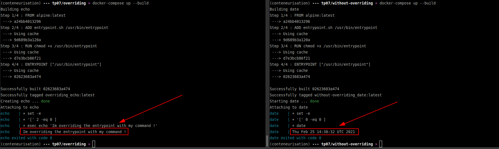

# Conteneurisation M2 TP07

## Différence entre ENTRYPOINT et CMD

Dans ce repository on peut trouver plusieurs choses : 
- 2 docker-compose [ici](without-overriding/) et [ici](overriding/)
* 1 Dockerfile [ici](Dockerfile)
* 1 script d'entrypoint [ici](entrypoint.sh)

* run the project.
```bash
cd without-overriding/
docker-compose up --build
cd overriding/
docker-compose up --build
```

* proof.

